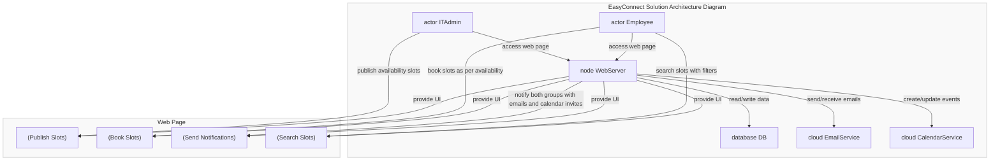

# Smart IT Patch Management System

```mermaid
graph TD;
  subgraph it_patch_management[IT Patch Management System]
    gateway(Gateway)
    slot_management(Slot Management Service)
    patch_management(Patch Management Service)
    user_management(User Management Service)
    compliance_reporting(Compliance Reporting Service)
    common_services(Common Services)
  end

  gateway -->|Gateway| slot_management
  gateway -->|Gateway| patch_management
  gateway -->|Gateway| user_management
  gateway -->|Gateway| compliance_reporting
  gateway -->|Gateway| common_services

  subgraph slot_management_service[Slot Management Service]
    add_slot(Add Slot)
    add_slots(Add Slots)
    delete_slot(Delete Slot)
    delete_slots(Delete Slots)
    slot_book_ui(Slot Book UI)
    filter_service(Filter Service)
  end

  slot_management -->|Slot Management| add_slot
  slot_management -->|Slot Management| add_slots
  slot_management -->|Slot Management| delete_slot
  slot_management -->|Slot Management| delete_slots
  slot_management -->|Slot Management| slot_book_ui
  slot_management -->|Slot Management| filter_service

  subgraph patch_management_service[Patch Management Service]
    patch_catalog(Patch Catalog)
    create_patch(Create Patch)
    delete_patch(Delete Patch)
    tag_patch(Tag Patch)
    untag_patch(Un-Tag Patch)
    soft_scan(SoftScan)
  end

  patch_management -->|Patch Management| patch_catalog
  patch_management -->|Patch Management| create_patch
  patch_management -->|Patch Management| delete_patch
  patch_management -->|Patch Management| tag_patch
  patch_management -->|Patch Management| untag_patch
  patch_management -->|Patch Management| soft_scan

  subgraph user_management_service[User Management Service]
    employee_listing(Employee Listing)
    add_employee(Add Employee)
    remove_employee(Remove Employee/Employees)
    admin_listing(Admin Listing)
    add_admin(Add Admin)
    remove_admin(Remove Admin/ Admins)
    add_region(Add Region)
    add_role(Add Role)
    role_listing(Role Listing)
    region_listing(Region Listing)
  end

  user_management -->|User Management| employee_listing
  user_management -->|User Management| add_employee
  user_management -->|User Management| remove_employee
  user_management -->|User Management| admin_listing
  user_management -->|User Management| add_admin
  user_management -->|User Management| remove_admin
  user_management -->|User Management| add_region
  user_management -->|User Management| add_role
  user_management -->|User Management| role_listing
  user_management -->|User Management| region_listing

  subgraph compliance_reporting_service[Compliance Reporting Service]
    compliance_report_listing(Compliance Report Listing)
    dashboards(Dashboards)
  end

  compliance_reporting -->|Compliance Reporting| compliance_report_listing
  compliance_reporting -->|Compliance Reporting| dashboards

  common_services -->|Common Services| notification_event_calendar(Notification, Event, Calendar Service)
  common_services -->|Common Services| database_tabs(Database Tabs)
  common_services -->|Common Services| filter(Filter)
  common_services -->|Common Services| pagination
  common_services -->|Common Services| search_sorting(Search, Sorting)


```

## Microservices -    
 -  [it-patch-management](https://github.com/jdk-world/it-patch-management)    
 -  [compliance-reporting-service](https://github.com/jdk-world/compliance-reporting-service)       
 -  [patch-management-services](https://github.com/jdk-world/patch-management-services)       
 -  [user-management-service](https://github.com/jdk-world/user-management-service)   
 -  [slot-management-service](https://github.com/jdk-world/slot-management-service)    

