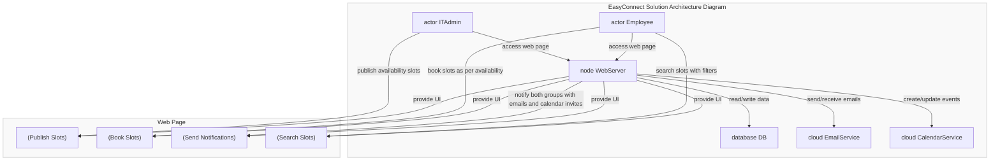

# Smart IT Patch Management System

@startuml
!define RECTANGLE class

RECTANGLE it_patch_management {
  Gateway
  UI
}

RECTANGLE slot_management_service {
  AddSlot
  AddSlots
  DeleteSlot
  DeleteSlots
  SlotBookUI
  FilterService
}

RECTANGLE patch_management_services {
  PatchCatalog
  CreatePatch
  DeletePatch
  TagPatch
  UnTagPatch
  SoftScan
}

RECTANGLE user_management_service {
  EmployeeListing
  AddEmployee
  RemoveEmployee
  AdminListing
  AddAdmin
  RemoveAdmin
  AddRegion
  AddRole
  RoleListing
  RegionListing
}

RECTANGLE compliance_reporting_service {
  ComplianceReportListing
  Dashboards
}

RECTANGLE common_services {
  NotificationEventCalendarService
  DatabaseTabs
  Filter
  Pagination
  Search
  Sorting
}

it_patch_management --> slot_management_service
it_patch_management --> patch_management_services
it_patch_management --> user_management_service
it_patch_management --> compliance_reporting_service
it_patch_management --> common_services

@enduml

## Microservices -    
 -  [it-patch-management](https://github.com/jdk-world/it-patch-management)    
 -  [compliance-reporting-service](https://github.com/jdk-world/compliance-reporting-service)       
 -  [patch-management-services](https://github.com/jdk-world/patch-management-services)       
 -  [user-management-service](https://github.com/jdk-world/user-management-service)   
 -  [slot-management-service](https://github.com/jdk-world/slot-management-service)    

