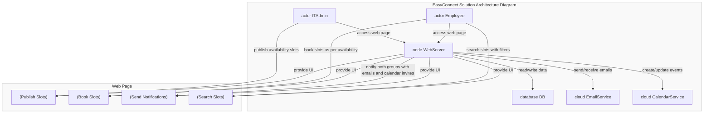

# Smart IT Patch Management System

## Microservices -    
 -  [it-patch-management](https://github.com/jdk-world/it-patch-management)    
 -  [compliance-reporting-service](https://github.com/jdk-world/compliance-reporting-service)       
 -  [patch-management-services](https://github.com/jdk-world/patch-management-services)       
 -  [user-management-service](https://github.com/jdk-world/user-management-service)   
 -  [slot-management-service](https://github.com/jdk-world/slot-management-service)    

## Broad Area of Work

Create a centralized IT Patch Management platform for employees and IT Admins. Where IT Admins can publish the availability slots, and employees can book slots as per their availability. Post booking of the slots, both the groups shall be notified with Calendar and Google Invites. This platform also provides search option with various filters, which employees can use before booking the slots. (E.g.: Based on the region, time-zones, slots timings).

### Background

IT Patch Management Platform helps the organization to meet the business driver to be innovative and be efficient in managing time, cost, resources, and assets. Few Pain Points, currently faced by IT Admin and Employees are - Communication delay, Time management, Conforming to organization’s IT Asset policies in timely manner, Inefficient and unorganized communication between 2 groups (Admin and Employees).

Overall, the proposed solution addresses the current pain points in patch management systems by creating a centralized platform that improves communication, time management, and compliance with IT asset policies. Here are some details about how the proposed solution addresses each pain point: 

    - Communication delay:    
    
The proposed solution creates a centralized platform where employees and IT admins can communicate easily and efficiently. This is because the platform provides several features that make it easy for employees to find the information they need, such as a search option with various filters. Additionally, the platform allows employees to book time slots for patch updates, which helps to ensure that everyone is aware of the latest patch updates and that patch updates are completed in a timely manner. 

    - Time management:    
    
The proposed solution allows employees to book time slots for patch updates. This helps to ensure that employees are not interrupted during work hours and that patch updates are completed in a timely manner. Additionally, the platform provides several features that help employees to manage their time effectively, such as a reminder system that notifies employees when it is time to apply a patch. 

    - Conforming to organization's IT Asset policies in timely manner:   
    
The proposed solution provides a search option with various filters, which employees can use before booking the slots. This helps to ensure that employees are only applying patches that are relevant to their role and that they are not applying patches that could potentially damage their systems. Additionally, the platform allows employees to view a list of all the patches that are required for their system, which helps them to stay compliant with IT asset policies. 

    - Inefficient and unorganized communication between 2 groups (Admin and Employees):   
    
The proposed solution creates a centralized platform where employees and IT admins can communicate easily and efficiently. This is because the platform provides a number of features that make it easy for employees to communicate with IT admins, such as a messaging system and a file sharing system. Additionally, the platform allows employees to track the status of their patch updates, which helps to ensure that there is no confusion between employees and IT admins. 

